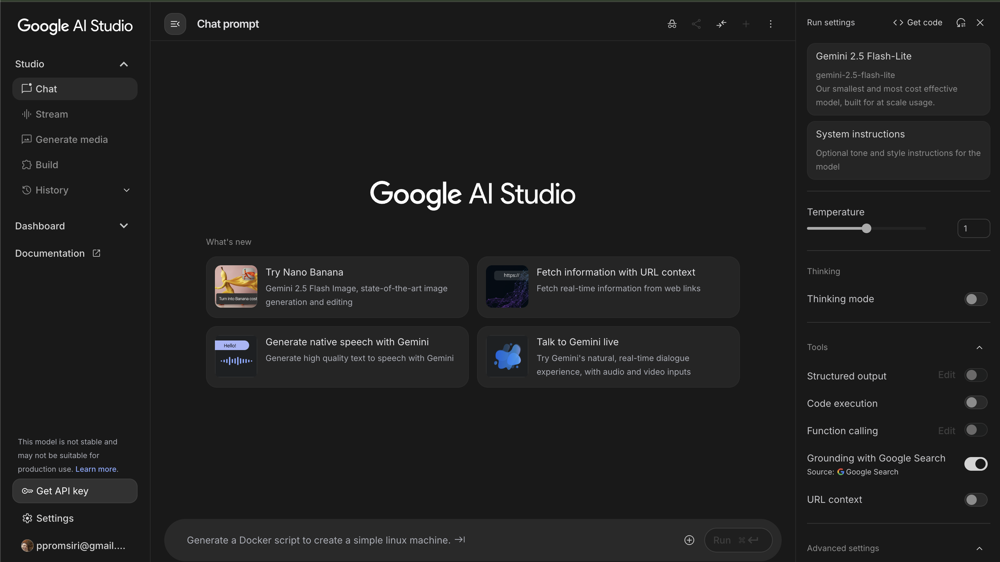

## 🤖 Google AI Studio: คู่มือการใช้งานฉบับสมบูรณ์ 📖

Google AI Studio เป็นแพลตฟอร์มที่ช่วยให้คุณสามารถสร้างสรรค์และทดลองกับโมเดล AI ของ Google ได้อย่างง่ายดาย 🎨 ไม่ว่าคุณจะเป็นนักพัฒนา 👩‍💻 นักการตลาด 📈 หรือบุคคลทั่วไปที่สนใจในเทคโนโลยี AI 🤖 ก็สามารถเข้ามาใช้งานได้ฟรี บทความนี้จะแนะนำวิธีการใช้งาน Google AI Studio ตั้งแต่เริ่มต้นจนถึงการรับ API Key 🔑 เพื่อนำไปใช้กับแอปพลิเคชันของคุณ

### 1. 🚪 การเข้าใช้งาน Google AI Studio

เริ่มต้นใช้งาน Google AI Studio ได้ง่ายๆ เพียงไปที่เว็บไซต์: [aistudio.google.com](https://aistudio.google.com/) 🌐

*   **ลงชื่อเข้าใช้:** คุณจะต้องลงชื่อเข้าใช้ด้วยบัญชี Google ของคุณ 🔑
*   **หน้าตาโปรแกรม:** เมื่อเข้าสู่ระบบแล้ว คุณจะพบกับหน้าจอที่มีเมนูและฟังก์ชันต่างๆ ที่พร้อมให้คุณใช้งาน 🖥️

**(ภาพประกอบ: หน้าจอหลักของ Google AI Studio)**

### 2. ✨ ฟีเจอร์หลักของ Google AI Studio

Google AI Studio มีฟีเจอร์หลากหลายที่ช่วยให้การสร้างสรรค์ผลงาน AI เป็นเรื่องง่ายและมีประสิทธิภาพ:

*   **การเลือกโมเดล (Model Selection) 🧠:** คุณสามารถเลือกใช้โมเดล Gemini ได้หลากหลาย เช่น Gemini 1.0 Pro, Gemini 1.5 Pro/Flash และ Gemma 2 แต่ละโมเดลมีความสามารถและข้อจำกัดที่แตกต่างกัน รวมถึงช่วง Token Limit ที่หลากหลาย (ตั้งแต่ 8,000 ถึง 2 ล้าน) ทำให้รองรับการใช้งานที่ต้องการหน่วยความจำระยะยาว การประมวลผลแบบ Multimodal และการโต้ตอบแบบเรียลไทม์
*   **การสร้าง Prompt (Prompt Engineering) ✍️:** Google AI Studio มี Prompt Playground ที่ให้คุณทดลองสร้างสรรค์ข้อความและปรับแต่งพารามิเตอร์ต่างๆ เพื่อควบคุมการตอบสนองของ AI เช่น:
    *   **Temperature:** ควบคุมระดับความสุ่มและความคิดสร้างสรรค์ของการตอบสนอง (0.1–1.0) 🌡️
    *   **Max Tokens:** กำหนดความยาวสูงสุดของการตอบสนอง
    *   **Safety Filters:** ปรับระดับการกรองเนื้อหาเพื่อป้องกันผลลัพธ์ที่ไม่เหมาะสมหรือไม่ถูกต้อง 🛡️
*   **การสร้างรูปภาพ (Image Generation) 🖼️:** คุณสามารถสร้างรูปภาพที่สมจริงได้ง่ายๆ เพียงป้อนคำสั่ง (Prompt) เป็นภาษาไทย เช่น "สร้างภาพคนยืนริมทะเล" หรือ "สร้างภาพนางแบบคนจีนในชุดสีแดงถือสินค้า"
*   **JSON Mode 🧬:** สำหรับนักพัฒนาที่ต้องการผลลัพธ์ที่แน่นอนและมีโครงสร้าง Google AI Studio มี JSON Mode ที่ช่วยให้ AI สร้างผลลัพธ์ตาม Schema ที่กำหนดไว้ ซึ่งมีประโยชน์ในการสร้าง Workflow อัตโนมัติ หรือแอปพลิเคชันที่ต้องการข้อมูลในรูปแบบที่จัดโครงสร้าง
*   **การประมวลผลโค้ด (Code Execution) 💻:** คุณสามารถสร้างและรันโค้ด Python หรือ JavaScript ได้โดยตรงภายใน Google AI Studio เพื่อทำงานอัตโนมัติต่างๆ เช่น การวิเคราะห์ข้อมูล การสร้างสคริปต์ หรือการดีบักโค้ด
*   **Stream Real Time 💬:** ฟีเจอร์นี้ช่วยให้คุณสนทนากับ AI ได้โดยตรง AI จะช่วยตอบคำถามและให้คำแนะนำทันที
*   **การสร้างเสียงและวิดีโอ (Audio and Video Generation) 🔊📹:** Google AI Studio สามารถแปลงข้อความเป็นเสียงพูดได้ ทั้งเสียงพูดคนเดียว (Single Speaker) และบทสนทนา 2 คน (Multi Speaker) นอกจากนี้ยังมีความสามารถในการสร้างวิดีโอจากข้อความได้อีกด้วย (Veo 2)
*   **การรวมสื่อ (Media Input) 📎:** คุณสามารถรวมข้อมูลภายนอก สื่อ หรือรูปแบบเฉพาะ (เสียง รูปภาพ วิดีโอ) เข้ากับการโต้ตอบของคุณกับโมเดล AI

**(ภาพประกอบ: ตัวอย่างการสร้าง Prompt และผลลัพธ์รูปภาพ)**

### 3. 🔑 การรับ API Key

API Key ใช้เพื่อยืนยันตัวตนและอนุญาตให้แอปพลิเคชันของคุณสื่อสารกับบริการ AI ของ Google ได้อย่างปลอดภัย

*   **ขั้นตอนการรับ API Key:**
    1.  เข้าสู่ Google AI Studio ([aistudio.google.com](https://aistudio.google.com/)) และลงชื่อเข้าใช้
    2.  ที่แผงด้านซ้ายของหน้าจอ หาปุ่ม **"Get API Key"** แล้วคลิก 👆
    3.  คลิก **"Create API key"** ✨
    4.  ระบบจะสร้าง API Key ให้คุณ **อย่าลืมคัดลอกและบันทึก API Key ของคุณไว้ให้ปลอดภัย** 🤫

**(ภาพประกอบ: ปุ่ม "Get API Key" ใน Google AI Studio)**

**(ภาพประกอบ: หน้าต่างแสดง API Key ที่สร้างขึ้น)**

### 📝 ข้อควรจำ

*   Google AI Studio มีแพ็คเกจฟรีสำหรับการเริ่มต้นใช้งาน 🆓
*   API Key ที่สร้างขึ้นนั้นฟรี แต่มีข้อจำกัดด้านอัตราการใช้งาน (Rate Limits) ซึ่งอาจไม่เพียงพอสำหรับการใช้งานในระดับ Production 📈
*   ควรเก็บรักษา API Key ของคุณไว้เป็นความลับ 🤫 และใช้ Environment Variables เพื่อความปลอดภัยเมื่อนำไปใช้งานในโค้ด

ด้วย Google AI Studio คุณสามารถปลดล็อกศักยภาพของ AI และนำไปประยุกต์ใช้กับโปรเจกต์ของคุณได้อย่างมีประสิทธิภาพ! 🚀